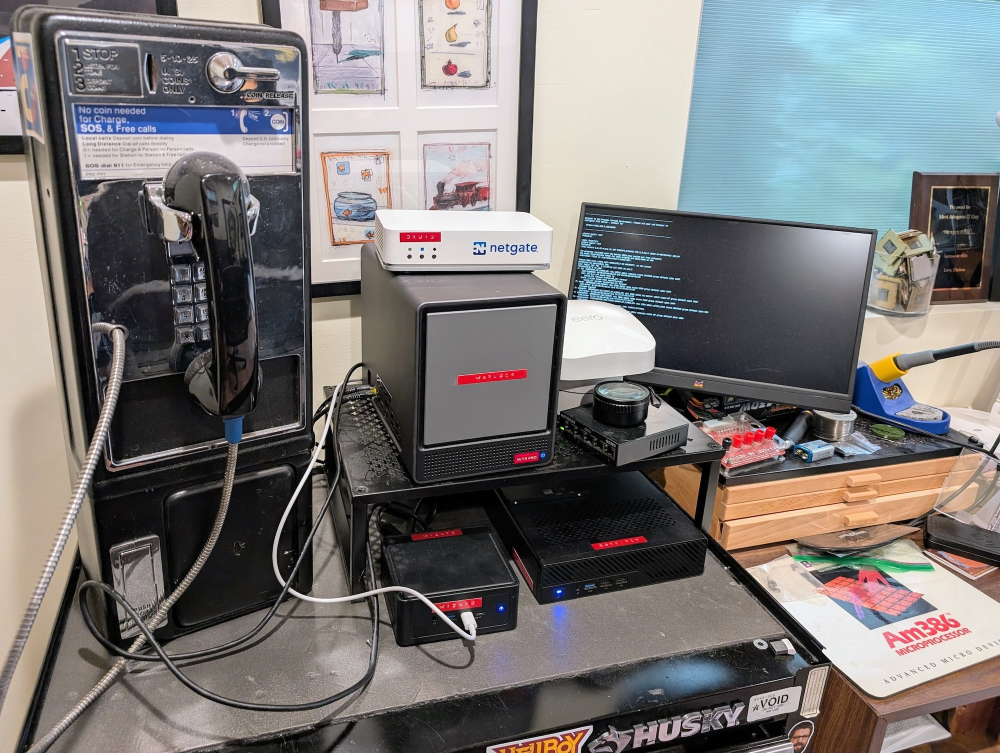

# VERSALIMINAL LAB

## High-Level Diagram


## Compute Node Configurations
```json
[
  {
    "Name": "warlock",
    "Cores": 16,
    "StorageTB": 1,
    "MemoryGB": 64
  },
  {
    "Name": "sorcerer",
    "Cores": 20,
    "StorageTB": 4,
    "MemoryGB": 48
  },
  {
    "Name": "wizard",
    "Cores": 22,
    "StorageTB": 4,
    "MemoryGB": 64
  }
]
```

## Storage Group Configurations
```json
[
    {
        "Name": "SG1",
        "StorageTB": 10,
        "Host": "warlock"
    }
]
```
## Physical Setup
